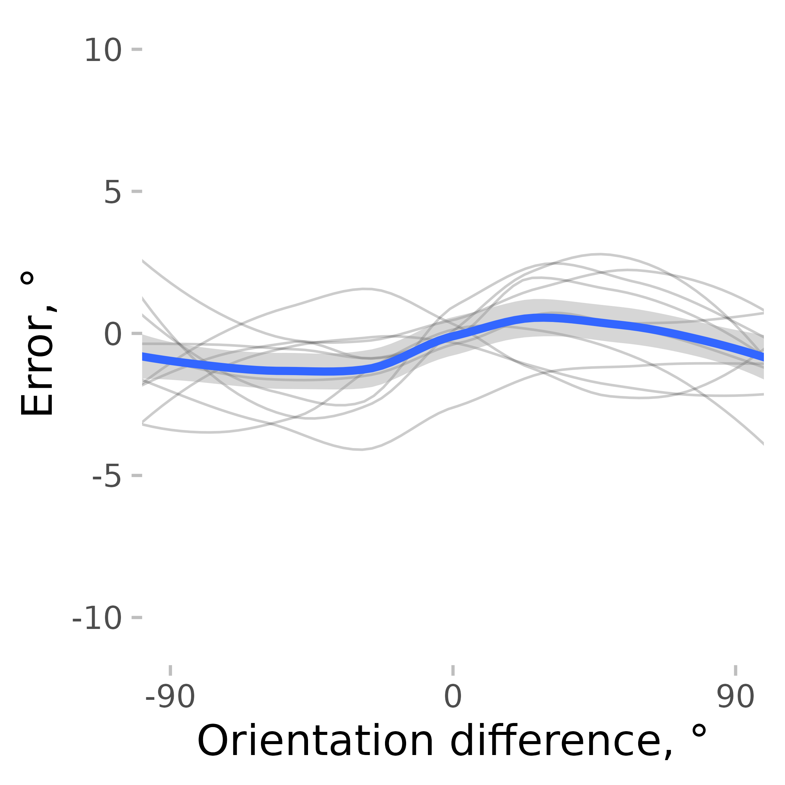
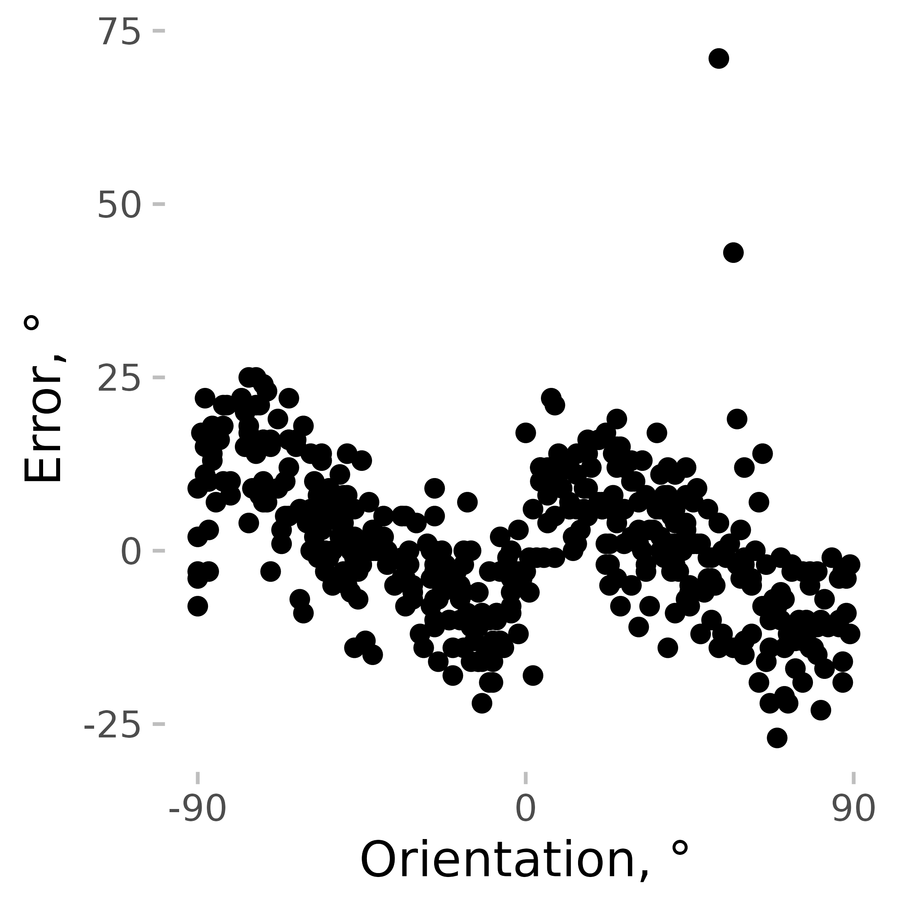
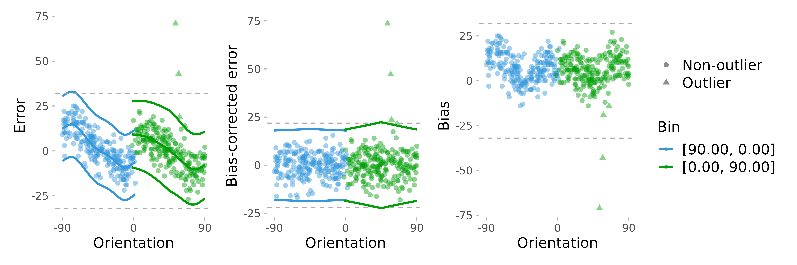
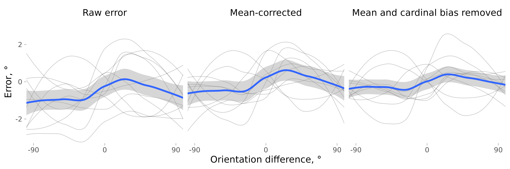
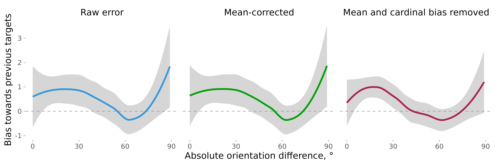

# Correcting for cardinal biases to improve serial dependence estimates

This is a small vignette showing how correcting for cardinal biases
might improve serial dependence (SD) estimates. I will use the data from
Experiment 2 in Pascucci et al. (2019, PLOS Biology,
<https://dx.doi.org/10.1371/journal.pbio.3000144>) available from
<https://doi.org/10.5281/zenodo.2544946>. First, I load the data, the
required packages, and compute important variables.

``` r
# load the data
# data <- fread('https://zenodo.org/record/2544946/files/Experiment2_rawdata.csv?download=1')
data <- Pascucci_et_al_2019_data
data[, err := angle_diff_180(reported, orientation)] # response errors
data[, prev_ori := shift(orientation), by = observer] # orientation on previous trial
data[, diff_in_ori := angle_diff_180(prev_ori, orientation)] # shift in orientations between trials
```

The responses in this data show a typical SD pattern with a bias towards
previous orientations. I use the `pad_circ` function to account for
circularity in the data when smoothing. It adds part of the data from
one end to another end of the variable range (e.g., the data with the
relative orientation from 60 to 90° are copied and pasted to the data
set with the new relative orientation values of -120 to 90°). This is
not the perfect way to account for circularity, but it is good enough
for this kind of analysis. The thin lines show individual observers, and
the thick blue line shows the average.

``` r
ggplot(pad_circ(data, "diff_in_ori"), aes(x = diff_in_ori, y = err)) +
  geom_line(aes(group = observer), stat = "smooth", size = 0.4, color = "black", alpha = 0.2, method = "loess") +
  geom_smooth(se = T, method = "loess") +
  coord_cartesian(xlim = c(-90, 90)) +
  scale_x_continuous(breaks = seq(-90, 90, 90)) +
  labs(y = "Error, °", x = "Orientation difference, °")
#> `geom_smooth()` using formula = 'y ~ x'
#> `geom_smooth()` using formula = 'y ~ x'
```



But SD is not the only bias present. The orientation estimates usually
show cardinal biases, that is, a repulsion effect with responses
“repulsed away” from cardinal orientations. Here is an example observer
where this pattern is clearly seen.

``` r
ggplot(data[observer == 4, ], aes(x = angle_diff_180(orientation, 0), y = err)) +
  geom_point() +
  coord_cartesian(xlim = c(-90, 90)) +
  scale_x_continuous(breaks = seq(-90, 90, 90)) +
  labs(y = "Error, °", x = "Orientation, °")
```



Cardinal biases (like any other biases) not only add noise to the data
but can also mimic other biases, such as SD. For example, if an observer
is presented with an 8° line followed by a 2° line, the estimates of the
2° line would be pushed towards 8° because of the cardinal bias, not
solely because of SD. It’s not necessarily a problem for a well-balanced
design, but it’s better to remove them to be on the safe side.

remove_cardinal_biases removes the cardinal biases and other similar
orientation-dependent idiosyncrasies by fitting a set of polynomials to
the data and computing the residuals. In other words, it tries to
predict how the errors change on average with changes in orientation and
removes that dependence. Additionally, it tries to estimate which
responses are outliers while accounting for changes in response variance
across orientations (see more in
[`remove_cardinal_biases()`](https://achetverikov.github.io/circhelp/index.html/reference/remove_cardinal_biases.md)).

``` r
ex_subj_data <- data[observer == 4, ]
res <- remove_cardinal_biases(ex_subj_data$err, ex_subj_data$orientation, plots = "show")
```



To illustrate how it works, we can plot some output from this function.
The first plot shows the errors the same way as in the previous plot but
adds the fitted polynomials to them. The second one shows the errors
with the biases removed. The third one plots only the bias (disregarding
the sign of the average error).

Then, we can check how SD estimates are affected by the removal of
cardinal biases. For the sake of completeness, I also show the result of
removing the mean error only (which is close to nothing).

First, for each observer, I compute a corrected error and find the
trials likely to be the outliers. `remove_cardinal_biases` returns a
`data.table` object with multiple columns with the most commonly used
ones being the bias-corrected error (`be_c`) and an outlier marker
(`is_outlier`). I save them in the `data`:

``` r
data[, c("err_corrected", "is_outlier") := remove_cardinal_biases(err, orientation)[, c("be_c", "is_outlier")], by = observer]
```

As a comparison, we can just use a correction for the overall mean
error.

``` r
data[, err_mean_corrected := angle_diff_180(err, circ_mean_180(err)), by = observer]
```

Then, I plot these errors along with the raw errors as a function of the
previous item orientation (with the outliers removed) and plot them.

``` r
datam <- melt(data[!is.na(diff_in_ori)], id.vars = c("diff_in_ori", "observer", "is_outlier"), measure.vars = c("err", "err_corrected", "err_mean_corrected"))
datam[, variablef := factor(variable, levels = c("err", "err_mean_corrected", "err_corrected"), labels = c("Raw error", "Mean-corrected", "Mean and cardinal bias removed"))]
datam[, err_rel_to_prev_targ := ifelse(diff_in_ori < 0, -value, value)]

ggplot(pad_circ(datam[is_outlier == F], "diff_in_ori"), aes(x = diff_in_ori, y = value)) +
  geom_line(aes(group = observer), stat = "smooth", size = 0.4, color = "black", alpha = 0.2, method = "loess") +
  geom_smooth(se = TRUE, method = "loess") +
  facet_grid(~variablef) +
  coord_cartesian(xlim = c(-90, 90), ylim = c(-3, 3)) +
  scale_x_continuous(breaks = seq(-90, 90, 90)) +
  labs(y = "Error, °", x = "Orientation difference, °")
#> `geom_smooth()` using formula = 'y ~ x'
#> `geom_smooth()` using formula = 'y ~ x'
```



To make things clearer, I plot serial dependence as a function of
absolute orientation differences.

``` r
ggplot(datam[is_outlier == F], aes(
  x = abs(diff_in_ori),
  y = err_rel_to_prev_targ,
  color = variablef
)) +
  geom_hline(linetype = 2, yintercept = 0) +
  geom_smooth(se = TRUE, method = "loess") +
  facet_grid(~variablef) +
  coord_cartesian(xlim = c(0, 90)) +
  theme(legend.position = "none") +
  labs(
    color = NULL, y = "Bias towards previous targets",
    x = "Absolute orientation difference, °"
  ) +
  scale_x_continuous(breaks = seq(0, 90, 30))
#> `geom_smooth()` using formula = 'y ~ x'
```



As you can see, when estimated using error corrected for cardinal bias,
SD looks “better” in the sense that around zero (where no bias is
expected), the SD is closer to zero, and there is also less of a bump
around 90° (this bump is probably a result of the large error
variability / fewer data points in this dataset). Correcting for
cardinal biases also reduces the variability of the errors, making the
SD effect more pronounced. But note also that the confidence intervals
in these plots are not quite right as they do not account for
between-subject and within-subject variability properly. A better
approach is to bin the data or to smooth the data by subject and then
compute the confidence intervals. These approaches are illustrated in
[`vignette('serial_dependence_with_density_asymmetry')`](https://achetverikov.github.io/circhelp/index.html/articles/serial_dependence_with_density_asymmetry.md).
