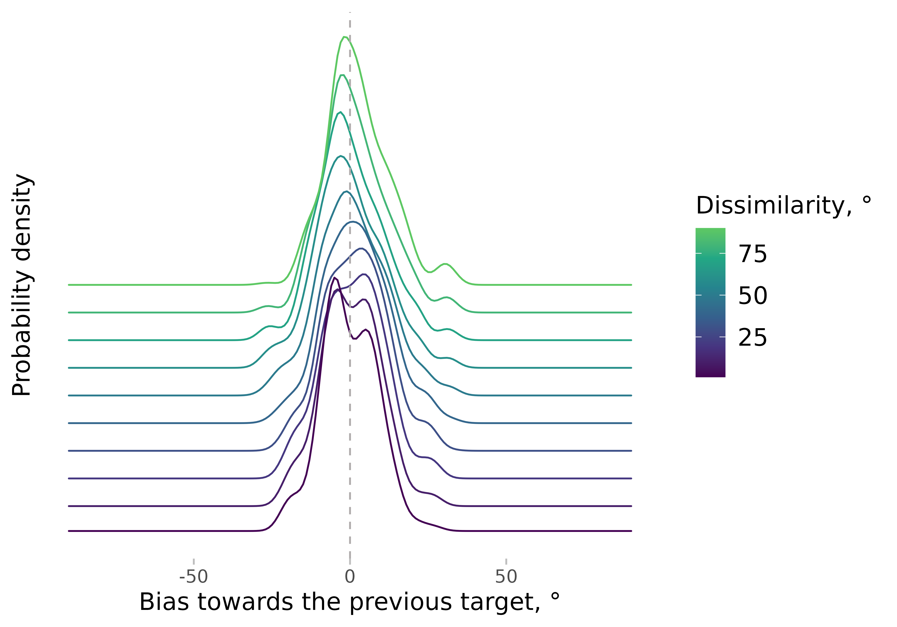
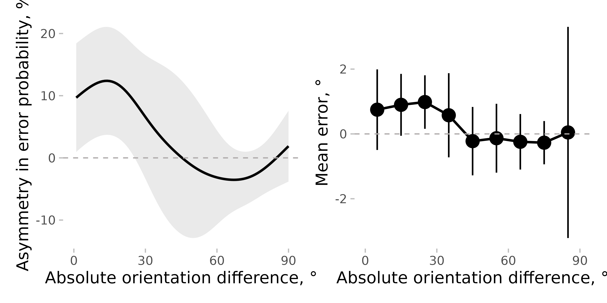

# Estimating serial dependence with density_asymmetry()

In this vignette, I show how to estimate the serial dependence bias
using the asymmetry in error probability density (note that this feature
is currently only available from the developmental version on Github).
This can be done using the
[`density_asymmetry()`](https://achetverikov.github.io/circhelp/index.html/reference/density_asymmetry.md)
function.

I will use the data from Experiment 2 in Pascucci et al. (2019, PLOS
Biology, <https://dx.doi.org/10.1371/journal.pbio.3000144>) available
from <https://doi.org/10.5281/zenodo.2544946>. First, I load the data,
the required packages, and compute important variables.

``` r
data <- Pascucci_et_al_2019_data
data[, err := angle_diff_180(reported, orientation)] # response errors
data[, prev_ori := shift(orientation), by = observer] # orientation on previous trial
data[, diff_in_ori := angle_diff_180(prev_ori, orientation)] # shift in orientations between trials
data[, abs_diff_in_ori := abs(diff_in_ori)] # absolute shift, that is, dissimilarity between the current and the previous target
```

The data is preprocessed to remove cardinal biases (see
[`vignette('cardinal_biases')`](https://achetverikov.github.io/circhelp/index.html/articles/cardinal_biases.md):

``` r
data[, c("err_corrected", "is_outlier") := remove_cardinal_biases(err, orientation)[, c("be_c", "is_outlier")], by = observer]

data[, err_rel_to_prev_targ := ifelse(diff_in_ori < 0, -err_corrected, err_corrected)] # bias towards the previous target

# subset the data to remove outliers and trials with no responses / no previous responses
data <- data[!is.na(err_rel_to_prev_targ) & is_outlier == F ]
```

Now, the main part.
[`density_asymmetry()`](https://achetverikov.github.io/circhelp/index.html/reference/density_asymmetry.md)
computes a smoothed estimate of the asymmetry in error probability
across the dissimilarity range. Here is an example with the results
plotted at different dissimilarity steps from 0 to 90 degrees for one
observer:

``` r

err_dens <- density_asymmetry(data[observer == 1],
  circ_space = 180, weights_sd = 10,
  xvar = "abs_diff_in_ori", yvar = "err_rel_to_prev_targ", return_full_density = T
)

ggplot(err_dens[dist %in% c(1, seq(0, 90, 10))], 
       aes(x = x, y = y, color = dist, height = dist / 2000)) +
  geom_ridgeline(aes(group = dist), fill = NA, stat = "identity") +
  labs(x = "Bias towards the previous target, °", y = "Probability density", color = "Dissimilarity, °") +
  scale_color_viridis_c(end = 0.75) +
  geom_vline(linetype = 2, xintercept = 0) +
  theme(axis.text.y = element_blank(), axis.ticks.y = element_blank()) +
  guides(color = guide_colourbar())
```



The x-axis shows the bias, which means that the errors are arranged in a
way that positive bias corresponds to errors towards the previous
target. For each dissimilarity step, the probabilities are estimated not
only based on trials with exactly the same dissimilarity between the
current and previous target, but also from all trials. The trials are
weighted in a way that gives higher weight to trials with
dissimilarities closer to the current value (technically, the function
uses a Gaussian kernel with the standard deviation determined by
`weights_sd`).

Note that the density is rarely a symmetric bell-shaped Gaussian, which
makes using the mean as an overall estimator of bias problematic. This
is based on observations from a single observer - other observers might
have different patterns. This is one of the reasons why we started using
asymmetry in the density, i.e. the difference between the left and right
parts of the curve relative to zero.

We can then compute the asymmetry in the density (the main purpose of
the function) by dropping the parameter `return_full_density = T`. We
will also do it for all observers by specifying the parameter `by`:

``` r
err_dens <- density_asymmetry(data,
  circ_space = 180, weights_sd = 10,
  xvar = "abs_diff_in_ori", yvar = "err_rel_to_prev_targ", by = c("observer")
)
```

We can then compute the statistics to test whether the bias is different
from zero at different dissimilarity ranges (not shown here). Note that
these ranges will depend on the smoothing window (or, more precisely,
`weights_sd` - the standard deviations of a smoothing kernel). However,
usually the exact range, in which the serial dependence is present, is
not the main question of the study. The same issue will be present with
other approaches (e.g., the bin width used when binning the data will
have the same effect).

As a comparison, one can use binned errors:

``` r
data[, abs_diff_in_ori_bin := apastats2::adv_cut(abs_diff_in_ori, cuts = seq(0, 90, 10), include_oob = T, num_labels = F, labels_at_means = T)]

mean_err <- apastats2::get_superb_ci(data[!is.na(err_rel_to_prev_targ) & is_outlier == F], wid = "observer", within = "abs_diff_in_ori_bin", value_var = "err_rel_to_prev_targ")
#> Loading required namespace: superb
setDT(mean_err)
mean_err[, abs_diff_in_ori_bin := as.numeric(as.character(abs_diff_in_ori_bin))]
```

Putting them side by side:

``` r
p1 <- ggplot(err_dens[, mean_cl_normal(delta * 100), by = .(dist)], aes(x = dist, y = y, ymin = ymin, ymax = ymax)) +
  geom_line() +
  geom_ribbon(alpha = 0.1) +
  labs(y = "Asymmetry in error probability, %")

p2 <- ggplot(
  mean_err,
  aes(x = abs_diff_in_ori_bin, y = center, ymin = center + lowerwidth, ymax = center + upperwidth)
) +
  geom_line() +
  geom_pointrange() +
  labs(y = "Mean error, °")

(p1 + p2) &
  labs(x = "Absolute orientation difference, °") &
  geom_hline(yintercept = 0, linetype = 2) &
  scale_x_continuous(breaks = seq(0, 90, 30)) &
  coord_cartesian(xlim = c(0, 90))
```



As you can see, the overall pattern is similar, although the effect
seems clearer when using asymmetry in probability. Note also that the
high confidence interval (CI) for the very last bin appears for the mean
error but not for the asymmetry measure, as the latter is more robust
than the former (Pascucci et al. dataset has fewer data points in this
bin compared to the others).
